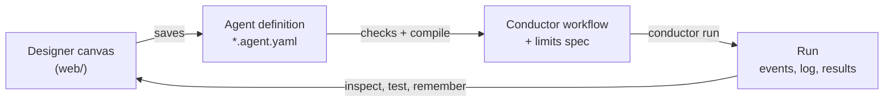

# Agent Orchestrator

**A designer canvas for [Microsoft Conductor](https://github.com/microsoft/conductor).** You build a multi-step agent
by placing steps on a canvas and filling in a form for each one, instead of hand-tuning one large prompt. The canvas
saves a restricted, declarative agent format. The service checks it against safety rules, compiles it to a Conductor
workflow, runs it, and shows you what happened, step by step.

Every design choice follows from one goal: **let a non-programmer build something reliable**, without the
prompt-engineering skill a single mega-prompt would need to handle every case correctly. A step's type says what it
may do; the service, not the prompt, holds it to that.



The examples in `examples/` are **travel-sync** (read travel confirmation emails, verify them, add approved trips to a
calendar) and **invoice-check** (match an invoice against its purchase order and receipts, then queue payment after
finance approves). Agents built on the canvas since include **issue-triage**, which classifies each open GitHub issue
by type and component, and **monthly-revenue-watch**, which flags weak months in BigQuery sales data.

## Contents

- [Core concepts](#core-concepts)
  - [Step types](#step-types)
  - [Deterministic computation tiers](#deterministic-computation-tiers)
  - [Data flow between steps](#data-flow-between-steps)
  - [Sandboxing and security boundaries](#sandboxing-and-security-boundaries)
  - [State vs. memory](#state-vs-memory)
- [How the canvas maps onto Conductor](#how-the-canvas-maps-onto-conductor)
- [The designer](#the-designer)
- [Connections](#connections)
- [Debugging and testing](#debugging-and-testing)
- [Getting started](#getting-started)
- [Path to enterprise-ready](#path-to-enterprise-ready)
- [Operating it in production](#operating-it-in-production)
- [Repository layout](#repository-layout)

## Core concepts

### Step types

Every step declares an explicit type, and the type decides its form fields and its guarantees. A step's type is
never inferred from which fields happen to be filled in.

| Concept | On the canvas | What it does | Guarantee |
|---|---|---|---|
| **Linear** | **Ask** | A model reads and extracts: one call, typed output | It can only read. Its tools are an explicit list; its output must match the record type |
| | **Built-in** | Fixed operations, no model: tidy up, look up, compare, match, BigQuery query, JavaScript | Same input, same output; costs nothing to re-run |
| | **Approve** | A person decides before anything changes | The first choice passes nothing, so a timeout or an unattended run changes nothing |
| | **Act** | Changes something outside the agent, using only checked fields | Only here can anything change; it follows the run's dry run |
| **Branch** | **Branch** | One decision with named paths, each leading to a fixed next step. Decided by rules (CEL) or by a model | One bounded decision; every path's downstream is fixed at design time. A model's answer that isn't a path takes the last, safe one |
| **Map** | **Parallel** | Ask steps at the same time; or a set of steps once for each item of a list | Each item runs on its own; concurrency and failure handling are explicit settings |
| **Free-form** | **Free-form** | A planning model picks which of its steps to run, how often, and when to stop | No fixed path, but bounded: data order, "Before finishing" rules the service enforces, and turn and Ask-run limits |

**Linear is the default.** Use a Branch only where a single judgment genuinely decides what happens next. Use
Parallel when the same work repeats over a list, or independent reads can overlap. Keep Free-form for work whose
sequence can't be set in advance: resolving an exception, or a search that depends on what the last search found.

A few properties of each flow block:

- **Branch.** *By rules*: CEL conditions checked in order, the first match wins, and the last path is Otherwise. *By a
  model*: a question, what it decides on, and a plain-language "when this is true" per path. The answer is a path
  name (an enum), a reason and evidence. **Hard rules first** are CEL checks that settle outcomes before the model is
  asked, e.g. amounts over a limit always go to review. A model-decided Branch may read to decide (read-only actions).
- **Parallel.** *Together*: Ask steps run at once, e.g. three mailboxes; later steps read their answers as usual.
  *For each item*: the block's steps run in order for every item of a list, several items at a time. A Branch inside
  routes per item: to one of the block's steps, on to the next, or to "the end, for this item". Approve stays
  outside, so a person approves once per run, not per item.
- **Free-form.** Free only within the order its data sets. A step runs once its inputs exist; "Before finishing"
  rules must hold before the block may finish; the planner decides the rest, and its reason for every step is in the
  run log. Ask steps in the same row of the data order can run together as a group the planner can pick. It holds
  only Ask and Built-in steps: Approve and Act run after the block, in a fixed order, so a planner fooled by
  untrusted content can skip a step but can't run a harmful one.

### Deterministic computation tiers

When a step's job is computation rather than judgment, use a deterministic engine instead of a model. There are
three tiers. Each gives more capability for a weaker guarantee:

| Tier | Can do | Can't do | Guarantee | Here |
|---|---|---|---|---|
| **CEL** | Filter, count, check existence, map fields | Sum, average, sort, date math | Not Turing-complete: always terminates; type-checked before it runs | Branch conditions, hard rules, Tidy up, pre-selection, "Before finishing", test expectations |
| **Script** (JavaScript in QuickJS) | Sum, average, sort, group, date math | Use arbitrary libraries | Deterministic and sandboxed: no files, network or other programs; 2 seconds and 64 MB per run | Built-in → JavaScript |
| **Free-form code execution** (Python) | Anything, including reading current library docs (e.g. via Context7) and iterating on errors | — | Agentic; bounded only by a step limit; needs a real sandbox | Not built yet |

**Use the narrowest tier that can do the job.** "Top N", "most / least", "ranked by" or any real numeric aggregation
is a clean signal to skip CEL and use a script. Reach for code execution only when a task needs an external, changing
API surface, or can't be bounded to one deterministic pass.

**Try it** runs a JavaScript step on sample inputs in the editor, or on the inputs it had in the latest run. A thrown
error, a timeout or a missing return field fails the step and says why.

### Data flow between steps

A step's **typed output** is the only channel data moves through. Record types (Booking, Issue, Invoice) describe
the shape; a step's **Takes** are picked references to earlier outputs, never typed free text:

```
read_invoice.invoice.po_number        an earlier step's field
tidy_up.trips[*].bookings             every item's field, flattened into one list
run.dry_run · trigger.sender_domain   a run option · the email that started the run
[a.x, b.x]  ·  a.x?                   any of these · optional
```

There is no second, informal channel. A step that needs an earlier step's reasoning gets it as an explicit field
(e.g. `classify.reason`), never as shared context. Two patterns follow:

- **Branch with a shared core.** When a Branch's paths produce different shapes (a flight, a hotel, a portal booking),
  every path should still emit the same core fields (sender, booking reference, travel date) plus a details object
  with the type-specific extras. Later steps reason only about the core, and don't care how many paths feed them.
- **Map.** Some sources return a fixed field set per item and need a second call per item for the rest. GitHub's list
  of pull requests, for example, omits `changed_files`, which only the single-PR call returns. A Parallel block for
  each item runs that call once per item and collects the results as `<block>.results`. Each model-decided Branch
  inside also hands on `<block>.<branch>.decisions` and `.by_path.<path>`: the items that took each path. Its cost
  grows with the list, so concurrency is an explicit setting.

### Sandboxing and security boundaries

Every step reaches the outside world only through a **connection**, and every connection call goes through the
**connector gateway**:

- **Least-privilege tools.** A step's tools are an explicit checklist. An unticked action is absent from the step's
  tool list entirely, not just discouraged in its instructions: the request shape enforces it, not the model's
  compliance.
- **Signed limits.** At run start the service mints one HMAC-signed limits token per connection use: which actions,
  which senders and date range, which repositories, sheets or datasets, which argument values. The gateway checks
  every call against it and logs it, allowed or refused. Some limits only exist mid-run: Double-check may open only
  the emails Tidy up cited.
- **Read vs. act.** Ask steps and Branches can only read. Only Act steps change anything, only with checked fields,
  and only after an Approve step if the builder puts one first. An Act step that runs after reading content other
  people wrote, with no Approve step first, is a warning on the canvas.
- **Untrusted text is data.** Email, issue and tool text is labelled as data written by other people, never
  instructions, in every prompt that sees it. Safety checks are "Before finishing" rules and hard rules, not prompt
  wording.
- **Pinned MCP tools.** An admin marks each MCP tool *read*, *act* or *not offered*. Approved tools are pinned: if a
  server changes a tool's description or arguments, the gateway refuses it until an admin reviews it.
- **Secrets stay in the vault.** OAuth tokens, API keys and service-account keys live in the workspace vault. They are
  never sent to the browser, and no model sees them.

CEL's guarantees are stronger than a sandbox's because they're structural, not environmental. CEL has no syntax for
I/O and no unbounded loops, so "can't reach the network" and "always terminates" are properties of the language, not
of what's around it. The same discipline carries to code execution: dependencies are baked into the image at build
time, nothing is installed at run time, and code reads and writes only through connections.

### State vs. memory

These are two different mechanisms, deliberately separate, and each attaches to different step types.

| | State (a checkpoint) | Memory (learned precedent) |
|---|---|---|
| Lives in | The orchestrator | A reviewable store: the agent's **Memory** tab |
| Used by | The orchestrator, to parameterize the next call | The model, shown past cases before it decides |
| Applies to | Ask steps with a filterable or pollable source | Model-decided Branches and Free-form blocks only |
| Update rule | Fixed and mechanical, e.g. watermark = max(seen ids) | The agent proposes; a person answers or corrects before it counts |
| Risk | None: no reasoning surface, nothing to audit | Real: it can silently drift a step's behavior, hence the review |
| Status | Not built yet | Built |

Temporal and Netflix Conductor both draw the same line. Their durable persistence exists to survive a crash *within*
one execution, never to carry state *across* executions implicitly. Cross-run continuity is always an explicit act.
State here should take the same shape: an explicit checkpoint, read at the start of a run and written at the end, held
outside Conductor's own within-run durability.

**Memory never applies to Linear or Act steps.** Their value is the promise that the same input produces the same
output. Memory would be a second, undeclared input, breaking the guarantee that tests and step composability depend
on. How memory works where it applies:

- **Recall.** Before deciding, a `<id>_recall` step finds the most similar confirmed cases. They're matched on the
  fields the builder picks (e.g. `sender_domain`, `issue.author`), most matching fields first, then the newest. The
  model is told they are data from earlier runs, not instructions.
- **Asking by exception.** Every decision says how sure it was (sure, leaning, unsure) and, when unsure, the other
  answer it would pick. A person is asked only about the unsure ones, and about a random 5% of the rest (adjustable)
  so confident mistakes surface too. With 300 issues that's the borderline dozen, not 300.
- **Correcting anything.** Any other decision can be corrected from its line in the run log. Nothing waits on it.
- **Nothing reaches a later run unreviewed.** Only answers and corrections a person gave are recalled. A run works
  from a snapshot of memory taken when it starts (`memory.json` in its folder), so it can be repeated exactly.
- **Staying small.** A newer answer about the same item replaces older ones. Each step keeps at most 200 remembered
  cases (corrections outlast confirmations), 100 waiting and 50 skipped.

## How the canvas maps onto Conductor

Nobody edits the Conductor YAML. The compiler (`src/agent_service/compiler.py`) turns a definition into a workflow
plus a **limits spec** (one entry per connection use). The compiled YAML is one click away in the editor, and
`tests/` fails if a checked-in example drifts from its definition.

| On the canvas | In Conductor |
|---|---|
| Ask | an `agent` step with an explicit `tools:` list and an output schema |
| Built-in | a `script` step running the step library (`agent-service-steps`) |
| Approve | a `human_gate` |
| Act | a `script` or `mcp` step calling the connector gateway |
| Branch, by rules | an `mcp` step on the CEL evaluator, with `routes:` on its results |
| Branch, by a model | an `agent` step whose output is `{path, reason, evidence, confidence, runner_up}`, routed on `output.path`; hard rules and recall run before it |
| Parallel, together | a `parallel:` group, then a step that records each answer for the run log |
| Parallel, for each item | a `for_each` group running a per-item workflow (`<id>.item.yaml`, written next to `workflow.yaml`), in which Branches route as usual; then a step that collects every item's results |
| Free-form | a planner `agent` routing to each inner step once its inputs exist, each routing back; `parallel:` groups for rows that run together; "Before finishing" checked by the CEL evaluator |

Every `command:` in a compiled workflow is one of the service's own programs:

| Program | What it is |
|---|---|
| `agent-service-gateway` | The connector gateway's stdio shim. Every limit comes from the signed token; every call is checked and logged. Serves sample data for test runs; forwards to the real system (Gmail, GitHub, BigQuery, MCP servers) for runs on real accounts |
| `agent-service-steps` | The Built-in step library: `tidy`, `lookup`, `filter-rows`, `compare`, `three-way-match`, `javascript`, `bigquery`, the Act operations, memory recall and the Parallel item and collect steps |
| `agent-service-cel` | The CEL evaluator (MCP). Returns `passed`, `failed`, `results` and `error`; on an error the run stops and names the rule, rather than guess |
| `agent-service-replay` | For tests: stands in for model steps and approvals with scripted answers |

A run is `conductor run` in web mode on its own port. The service follows its event log, answers approvals with
`conductor gate respond`, and keeps everything in the run's folder: `events.jsonl`, `history.jsonl` (each step's
inputs and outputs), `gateway.jsonl` (every connection call) and anything written.

What compiling to Conductor taught us:

- **Results collected across runs of a step.** Conductor keeps only a step's latest output, so a reader run again with
  a focus would drop what it found first. A Free-form block's `collect` keeps running lists.
- **Group members can't route.** Conductor won't put routes on a parallel group's members, so inside Free-form each
  member runs as a route-less copy (`read_airline__together`).
- **Only model, `set` and MCP steps run in a group.** That's why a *together* Parallel block holds Ask steps only, and
  why *for each item* compiles its steps to a per-item workflow instead.
- **Portable CEL.** A step that hasn't run is absent from the rules' data and tested with `has(steps.<id>)`, which
  every CEL implementation supports.
- **Rules must cover every outcome.** An early replay let the planner finish as "amounts differ" without running the
  three-way match; the rule now requires it for any outcome that claims a match result.
- **Outputs can't be optional at the top level**, so fields such as `confidence` are required, and old scripted
  answers without them count as "sure".

## The designer

| Screen | What it does |
|---|---|
| Home | Your workspace's agents: status, trigger, last run, Run now, New agent |
| New agent | Start blank, from a template, or **Describe it** and let Claude draft it; pick the test data |
| Editor | The step list, the canvas (Free-form blocks drawn by data order, with their loops; Parallel blocks with their steps; Branch paths), and a panel for everything. Autosaves; every save returns the service's errors pinned to fields, and publishing is blocked until there are none. **Refine with AI** changes a draft as asked; **Write with AI** helps with instructions and tasks |
| Run now / Test run | The version (or the draft), run options, the email for an email trigger, sample data or real accounts, Claude or scripted answers |
| Runs | Every run, live while it runs: outcome, what an Act step did or would do, the service's checks, the decisions it wants a person to answer, and a readable log with the planner's reasons, per-item lines, tool calls and costs |
| Tests | Saved test cases, run against the draft before publishing |
| Memory | The decisions waiting for an answer, and what's remembered |
| Approvals | Runs waiting for a person |
| Connections | Accounts (builders) and connectors (admins) |

**Describe it** and **Refine with AI** use Claude with the format reference, the example agents, and the workspace as
it is: accounts and permissions, each MCP connector's approved tools, the sample sets. Every draft goes through the
same checks as a saved agent; failures go back to Claude to fix, up to three rounds. The result is only ever a draft:
you see Claude's summary, its assumptions and questions, a refine can be undone, and nothing runs until you run it.

## Connections

Connections have three layers:

| Layer | Who | What |
|---|---|---|
| Connector | A workspace admin, once | The system's app settings (OAuth client, API URL, shared token or key), the most any account may be granted, who may connect accounts, and a **Test** |
| Account | Any builder (or only admins) | Connected through a connector and signed in, so its name comes from the system; permissions within what the connector offers |
| Step | The builder, on the canvas | Actions and limits within the account's permissions, checked by the gateway on every call |

| Connector | What steps can do |
|---|---|
| **Google Workspace** | Gmail: search and open (real mail after an admin sets up the OAuth client and a builder signs in). Sheets and Calendar use sample data for now |
| **GitHub** | Read only: search issues and pull requests, open one with its comments, read files, in the repositories each step names. Real runs use a fine-grained read-only token |
| **BigQuery** | Built-in "BigQuery query" (fixed SQL with `@parameters`), `run_query` / `list_tables` / `get_schema` for Ask steps, append-only inserts for Act steps. A dry run first checks every query: a single SELECT, only the step's data, under its byte cap and within the monthly budget. Test runs query sample tables in DuckDB |
| **Any MCP server** | A remote URL or a local command, signing in with OAuth, a bearer token, a header or nothing. Each tool is marked read, act or not offered, with argument limits; approved tools are pinned |

## Debugging and testing

- **Step inspector.** Click a step in a run's log to see everything about that run of it: the prompts with inputs
  filled in, each tool call with its result and the gateway's decision, and what the step returned.
- **Re-run one step** with the current draft, on exactly the inputs it had, and compare the outputs side by side.
- **Test cases.** Save any finished run as a test: the same inputs, approvals answered the same way, and expectations
  as CEL rules over the results, suggested from the run. The Tests tab runs them against the draft; Publish shows
  whether they pass.
- **Scripted answers.** Every example has a replay script, so whole runs work in real Conductor with no API key and no
  person.

## Getting started

```bash
uv sync
(cd web && npm install && npm run build)
ANTHROPIC_API_KEY=... uv run agent-service serve        # the designer: http://127.0.0.1:8700
```

Without an API key everything works except running model steps for real; runs can use scripted answers instead. For
front-end work, run `npm run dev` in `web/` (port 5173, proxying `/api` to 8700). The workspace lives in
`.workspace/`: agents with their drafts and published versions, runs, memory, and the vault.

From the command line:

```bash
uv run --group dev pytest        # the step library, compiler, API, whole runs in Conductor, the designer in a browser

uv run agent-service compile examples/invoice-check/invoice-check.agent.yaml -o examples/invoice-check/invoice-check.yaml

# A whole run with scripted model steps: no API key, no person.
uv run agent-service run examples/invoice-check/invoice-check.agent.yaml \
  --sample-data examples/invoice-check/sample-data --email-id inv-northwind-2208 \
  --replay examples/invoice-check/replay-northwind.yaml
```

## Path to enterprise-ready

This is a personal prototype. Most of the step-type and sandboxing decisions above already assume a multi-tenant
service, so what remains is mostly a storage-layer swap, not a redesign:

| Area | Now | Open design question |
|---|---|---|
| Workspace state | Files on one machine (`.workspace/`) | Per-tenant schemas vs. a database per tenant; which state is transactional (step config) and which eventually consistent (run logs) |
| AuthN / AuthZ | One signed-in user with an Admin role; connector-level "who may connect" | Real identity (OIDC / SAML); authorization scoped to connections: who may attach a Gmail account to a step someone else built |
| Deployment | Local; one `conductor run` process per run | The code-execution sandbox as ephemeral per-run pods vs. a warm pool, on GKE |
| Observability | Per-run event log, gateway log and step inspector | A span per step for Linear and Branch; a span per turn, with retries and tool calls, for Free-form |

Tenant isolation and connection-scoped authorization have the most open design surface. Kubernetes deployment is
familiar ground.

Not built yet:

- Schedules and email triggers that fire on their own
- Notifications for approvals
- The state checkpoint
- Free-form code execution
- Sheets and Calendar on real accounts
- More than one Free-form block per agent

## Operating it in production

The step types exist partly for incident response. A failing Linear step is a contained problem, bad output for a
known input, and can be reverted on its own without touching the rest of the agent. A single mega-prompt offers no such
isolation.

An AI assistant can triage fast when the observability is there: correlating an error spike with a recent publish,
reading a stack trace, spotting a timing-out connection. It is least reliable exactly where confidence doesn't signal
correctness: a generated fix reads as fluent and certain whether or not it's right. The mitigations, in order:

1. **Roll back before fixing live.** Going back to the last good version is faster and safer than diagnosing under
   pressure, for a person or an AI. Published versions never change, and Run now can pick any of them.
2. **A real code owner, even part-time**, who reviews changes closely enough to build real understanding over time.
3. **Rehearsed reviews, not only reactive ones.** Break a step in staging now and then, and have the code owner judge
   whether a proposed fix would have been right. That calibrates trust with evidence.
4. **Review by blast radius, not by reading everything.** A fix that touches only one step's declared inputs and
   outputs is a small, checkable claim, even for a reviewer who couldn't have written it. This is what the step-type
   contracts are for.

## Repository layout

| Path | What it is |
|---|---|
| `src/agent_service/definition.py` | The agent format and its safety rules |
| `src/agent_service/compiler.py` | Agent definition → Conductor workflow + limits spec |
| `src/agent_service/runner.py`, `cli.py` | Preparing and starting a run; `agent-service compile / run / serve` |
| `src/agent_service/runtime/` | What a run worker ships: the gateway and its connectors, the step library, the CEL evaluator, memory recall, replay |
| `src/agent_service/server/` | The designer's back end (FastAPI): workspace store, design-time analysis, runs, connectors, memory, tests, AI drafting |
| `web/` | The designer (React, TypeScript, Vite) |
| `examples/` | Example agents (definition, compiled workflow, limits spec, replay scripts) and sample data sets: travel emails, invoices, GitHub issues, BigQuery sales tables, water-utility alerts |
| `tests/` | The step library, compiler, API, whole runs in Conductor with scripted model steps, and the designer in a real browser |
| `docs/agent-service-design.md` | A snapshot of the original design doc |
| `designer/` | The original screen mocks (`canvas/project/*.dc.html`), generated by `designer/build.py`: edit `build.py`, not the HTML, then run `uv run --no-project --python 3.13 python designer/build.py` |

The design rationale behind the core concepts is in [Agent Service — Architecture & Design
Rationale](https://claude.ai/artifact/GyVUqEEixzToawAWo3vcf4).
