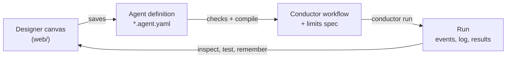

# Agent Orchestrator

**A designer canvas for [Microsoft Conductor](https://github.com/microsoft/conductor).** You build a multi-step agent
by placing steps on a canvas and filling in a form for each one, instead of hand-tuning one large prompt. The canvas
saves a restricted, declarative agent format. The service checks it against safety rules, compiles it to a Conductor
workflow, runs it, and shows you what happened, step by step.

Every design choice follows from one goal: **let a non-programmer build something reliable**, without the
prompt-engineering skill a single mega-prompt would need to handle every case correctly. A step's type says what it
may do; the service, not the prompt, holds it to that.



## Contents

- [Core concepts](#core-concepts)
- [Connectors](#connectors)
- [The designer](#the-designer)
- [What it's for](#what-its-for)
- [Use cases](#use-cases), including [data and ETL pipelines](#data-and-etl-pipelines)
- [Getting started](#getting-started)
- [Deploying to GKE](#deploying-to-gke)
- [Repository layout](#repository-layout)
- More: [core concepts in depth](docs/concepts.md) · [how the canvas maps onto Conductor](docs/conductor.md) ·
  [operating it](docs/operating.md)

## Core concepts

Every step declares an explicit type, and the type decides its form fields and its guarantees.

| On the canvas | What it does | Guarantee |
|---|---|---|
| **Ask** | A model reads and extracts: one call, typed output | It can only read. Its tools are an explicit list; its output must match the record type |
| **Built-in** | No model. CEL operators over a list, JavaScript, or SQL (BigQuery, Trino, Spark SQL); or a chart, file read or fixed operation | Same input, same output; costs nothing to re-run |
| **Approve** | A person decides before anything changes, wherever the builder puts one | The first choice passes nothing, so a timeout or an unattended run changes nothing |
| **Act** | Changes something outside the agent, using only checked fields | Only here can anything change; it follows the run's dry run |
| **Branch** | One decision with named paths, decided by rules (CEL) or by a model | Every path's next step is fixed at design time; a model's answer that isn't a path takes the last, safe one |
| **Parallel** | Steps at the same time, or a set of steps once for each item of a list | Each item runs on its own; concurrency and failure handling are explicit |
| **Free-form** | A planning model picks which of its steps to run, how often, and when to stop | Bounded by data order, "Before finishing" rules the service enforces, and turn limits |

**Linear is the default.** Use a Branch only where one judgment decides what happens next, Parallel when work repeats
over a list or independent reads can overlap, and Free-form only for work whose order can't be set in advance.
**Approval is available, never required.** Whether a person checks before an Act step is the builder's call; where one
might matter (an email a model wrote, an action on content other people wrote), the Act step shows a suggestion.

Four more ideas carry the rest of the design; each is covered in [Core concepts in depth](docs/concepts.md):

- **Use the narrowest engine.** CEL operators (keep, add fields, check, remove duplicates, sort, summarize, match,
  link) before JavaScript, JavaScript before a model.
- **Typed outputs are the only channel.** A step's inputs are picked references to earlier outputs
  (`read_invoice.invoice.po_number`), never free text.
- **Everything goes through the gateway.** Each connection use gets an HMAC-signed limits token; the gateway checks
  and logs every call. Ask steps and Branches only read; untrusted text is labelled as data; secrets stay in the vault.
- **Memory is reviewed precedent.** Model-decided Branches and Free-form blocks can recall past decisions a person
  confirmed. A person is asked only about the unsure ones (plus a small random sample), and anything can be corrected.

## Connectors

Connections have three layers: a **connector** an admin sets up once (app credentials, the most any account may be
granted, a Test); **accounts** builders connect through it; and each **step's** actions and limits, which the gateway
checks on every call.

| Connector | What steps can do |
|---|---|
| **Google Workspace** | Gmail: search, open, and send (Act steps, only to the recipients each step names; test and dry runs fill the run's outbox). Sheets and Calendar use sample data for now |
| **Microsoft 365** | SharePoint through Microsoft Graph as an Entra ID app (ask IT for `Sites.Selected`): list and read files (CSV and Excel as rows; Word, PDF and text as text), read SharePoint lists as rows, add new files. Email through an SMTP server: a company relay or Microsoft 365's, with the same recipient checks as Gmail |
| **GitHub** | Read only: search issues and pull requests, open one with its comments, read files, in the repositories each step names |
| **BigQuery** | Fixed SQL with `@parameters`, query tools for Ask steps, append-only inserts. Every query is dry-run first: one SELECT, only the step's data, under its byte cap and the monthly budget |
| **Trino** | Read-only SQL against a Trino server, e.g. the Trino component on Dataproc. Checked before it runs (one SELECT, only the step's catalogs and schemas), with row caps and a time limit |
| **Spark SQL (Dataproc)** | The same checks, run as Dataproc Serverless batches or jobs on a cluster; results come back through a staging folder. An admin can add jars and setup statements, e.g. to register Iceberg tables from their metadata files. A query takes a minute or more |
| **Cloud Storage** | List and read files (CSV, JSON, Parquet and Excel as rows; Word, PDF and text as text); an Act step writes a new file, never overwriting one |
| **Any MCP server** | A remote URL or a local command. An admin marks each tool read, act or not offered; approved tools are pinned and refused if the server changes them |

Test runs use sample data for every connector except MCP: `<sample set>/bigquery`, `/sql`, `/gcs`, `/sharepoint` and so
on, with the same checks.

## The designer

| Screen | What it does |
|---|---|
| Home | Your workspace's agents: status, trigger, last run, Run now, New agent |
| New agent | Start blank or from a template; **Describe it** for a one-shot draft; **Build with Claude**, a conversation in which Claude looks at your data first (tables, folders, files, lists, through the gateway, read-only and capped) and then drafts the agent |
| Editor | The step list, the canvas and a panel for everything. Every save returns the service's errors pinned to fields; publishing is blocked until there are none |
| Run now | A version or the draft, run options, sample data or real accounts, Claude or scripted answers |
| Runs | Live outcome, what an Act step did or would do, decisions waiting for a person, and a readable log with tool calls and costs. Click a step for its prompts, tool calls and output; re-run one step on the same inputs |
| Tests | Saved runs with CEL expectations, run against the draft before publishing |
| Memory · Approvals | Decisions waiting for an answer, what's remembered; runs waiting for a person |
| Connections | Accounts (builders) and connectors (admins) |

Every AI draft goes through the same checks as a saved agent and is only ever a draft: nothing runs until you run it.

## What it's for

Agents here fit work that comes back again and again in the same shape: **read** what people or systems wrote (email,
issues, files, tables, logs), **decide** something (is this a booking, does this invoice match, is this load OK, who
should know), and **act** (add an event, queue a payment, send a report), with the checks visible and a person's OK
wherever the builder wants one. Most of the steps are deterministic; a model handles the reading and the judgment
calls a rule can't make.

It's a poor fit for one-off questions (just ask a model) and for moving data at volume (that's a pipeline's job).

## Use cases

| Use case | Example | What it shows |
|---|---|---|
| **Personal and team automation** | **travel-sync** (`examples/travel-sync-free/`): each weekday morning, find travel bookings in email, double-check them, and add the trips you approve to your calendar | A Free-form block that searches several senders and follows what it finds; email treated as data, never instructions; the calendar changes only after you approve |
| **Back-office checks** | **invoice-check** (`examples/invoice-check/`): when an invoice arrives by email, match it to its purchase order and receipts, then queue payment after finance approves | An email trigger; a deterministic three-way match instead of a model's opinion; a person approves before money moves |
| **Triage and routing** | **issue-triage** (built on the canvas): classify each open GitHub issue by type and component, and say why one isn't actionable yet | A model-decided Branch for each item, with memory: a person is asked only about the unsure ones |
| **Alerts from email** | The **water alerts** sample set (`examples/water-alerts/`): utility leak alerts, including duplicates to merge, a look-alike sender and an alert with hidden instructions | Sender limits the gateway enforces; untrusted text handled as data |
| **Data and ETL pipelines** | **sales-load-check** (`examples/bigquery-sales/`): when a load finishes, check it, alert the data team if it failed, and report what moved | A Pub/Sub trigger, SQL and rule checks, charts, a model-decided Branch with memory, an approved report. [More below](#data-and-etl-pipelines) |

Each sample set in `examples/` stands in for real accounts in test runs. travel-sync, invoice-check and
sales-load-check also come with scripted model answers, so a whole run works without accounts or an API key.

### Data and ETL pipelines

**Your pipelines move the data. Agents decide what to do about it.** Spark, dbt, Dataproc and Airflow are good at
moving and reshaping data, deterministically and at volume. They leave a gap around the pipeline that a person
usually fills: noticing a load is late or wrong, working out why, deciding who needs to know, and acting on it, with
a person's OK where the builder wants one. That's what agents here are for. They sit beside the pipeline, never in its data path.

| | Batch ETL job | Agent here |
|---|---|---|
| **Job** | Move and reshape data: raw → processed → warehouse | Notice, explain, decide, route: is this load OK, why not, who needs to know, what happens next |
| **Volume** | Millions of rows, the whole dataset | Summaries, samples, metadata and logs: kilobytes to megabytes |
| **Logic** | Fully deterministic: same input, same output | Deterministic where it can be (SQL, CEL, JavaScript), judgment only where needed (a log, a policy doc, an email thread) |
| **Output** | Tables and files | Decisions, reports, emails, approvals, small writes (a summary file, a log row) |
| **When it's wrong** | Retry, backfill | A person corrects a decision; memory makes it less likely next time |
| **Talks to** | Other systems | People: owners, on-call, Finance, through email and approvals |
| **Cost** | Compute per byte processed | Cents of model and query cost per run |
| **Changes** | Code review and deploy | Built in the designer, tested on sample data, published as a new version |

**A rule of thumb.** If every run should give the same answer from the same input and touches more than a sample of
the data, it's a pipeline job. If it needs to interpret something messy, choose between options, or involve a person,
it's an agent. An agent can start a pipeline job; it should never do the job's work.

What agents add that pipeline and data-quality tools don't:

1. **Context beyond the tables.** Driver logs, Finance's targets in SharePoint, an email saying the CRM export is late.
2. **Explanations, not alerts.** "The job failed because the Iceberg jar is missing: a config problem, so a retry
   won't help," not "exit code 1."
3. **Routing and approval.** A Branch to the right owner; an Approve step wherever the builder wants a person to check
   first.
4. **Memory of decisions.** "Last time this happened at month-end, Finance said to ignore it."
5. **Mostly no model.** Most steps in the ETL examples are SQL, CEL rules or charts. The model writes the narrative or
   makes the one judgment call, so runs stay cheap, repeatable and testable.

Where the line could blur, the design holds it: Built-in steps have byte and row caps (a 50 GB transformation belongs
in the pipeline), and agents are meant to be what an orchestrator or a data-observability tool calls when a check
fails, not a replacement for either.

**Starting when a load finishes.** A trigger can be a **Pub/Sub subscription**. The pipeline publishes a message when
it finishes; each message runs the agent's published version on real accounts, with the message's fields as
`trigger.<field>` and an optional CEL filter. Delivery is at least once, so duplicates are skipped, and every message
is logged on the trigger's panel. For files, Cloud Storage can publish a notification per new object to a topic.

**sales-load-check** (`examples/bigquery-sales/`) is the pattern:

1. Three **BigQuery queries** read the loaded tables **together** in a Parallel block; a table that can't be read
   becomes a failed check, not a crashed run.
2. A **JavaScript** step runs the quality checks (rows present, no duplicate keys, no gaps, tables reconcile) and
   computes the KPIs.
3. If a check fails, an **Act** step emails the data team and the run ends.
4. Otherwise a **model-decided Branch** with memory asks whether anything moved enough to tell sales leadership.
5. If so, **Chart** steps draw the trends, an **Ask** step writes a short report, a person **approves** it with the
   charts in view, and an Act step emails it.

The same shape works on a data lake: Spark SQL or Trino steps in place of the BigQuery queries, targets read from a
SharePoint workbook, owners from a SharePoint list, the report written back to a SharePoint folder.

## Getting started

```bash
uv sync
(cd web && npm install && npm run build)
ANTHROPIC_API_KEY=... uv run agent-service serve        # the designer: http://127.0.0.1:8700
```

Without an API key everything works except running model steps for real; runs can use scripted answers instead. For
front-end work, run `npm run dev` in `web/` (port 5173, proxying `/api` to 8700). The workspace lives in
`.workspace/`: agents, runs, memory and the vault.

```bash
uv run --group dev pytest        # the step library, compiler, API, whole runs in Conductor, the designer in a browser

uv run agent-service compile examples/invoice-check/invoice-check.agent.yaml -o examples/invoice-check/invoice-check.yaml

# A whole run with scripted model steps: no API key, no person.
uv run agent-service run examples/invoice-check/invoice-check.agent.yaml \
  --sample-data examples/invoice-check/sample-data --email-id inv-northwind-2208 \
  --replay examples/invoice-check/replay-northwind.yaml
```

## Deploying to GKE

`deploy/gke/deploy.sh` builds the image with Cloud Build and runs the designer on GKE Autopilot as cheaply as GKE
allows: one spot pod, a 10 GB disk for the workspace, no public address (reach it with `kubectl port-forward`).
Google connectors use the pod's Workload Identity. `deploy/gke/copy-workspace.sh` copies a laptop's agents and
connectors to it; the laptop keeps its own workspace. Spot pods can be stopped with short notice, which fails a run in
progress. See [Operating it](docs/operating.md) for what production would still need.

## Repository layout

| Path | What it is |
|---|---|
| `src/agent_service/definition.py` | The agent format and its safety rules |
| `src/agent_service/compiler.py` | Agent definition → Conductor workflow + limits spec |
| `src/agent_service/runner.py`, `cli.py` | Preparing and starting a run; `agent-service compile / run / serve` |
| `src/agent_service/runtime/` | What a run worker ships: the gateway and its connectors, the step library, the CEL evaluator, memory recall, replay |
| `src/agent_service/server/` | The designer's back end (FastAPI): workspace store, design-time analysis, runs, connectors, memory, tests, AI drafting |
| `web/` | The designer (React, TypeScript, Vite) |
| `examples/` | Example agents and sample data sets: travel emails, invoices, GitHub issues, sales tables and files, a SharePoint site, water-utility alerts |
| `deploy/gke/` | The GKE deployment: manifests, deploy and workspace-copy scripts |
| `tests/` | The step library, compiler, API, whole runs in Conductor with scripted model steps, and the designer in a real browser |
| `docs/` | Core concepts in depth, the Conductor mapping, operating notes, and a snapshot of the original design doc |
| `designer/` | The original screen mocks, generated by `designer/build.py` |

The design rationale behind the core concepts is in [Agent Service — Architecture & Design
Rationale](https://claude.ai/artifact/GyVUqEEixzToawAWo3vcf4).

## License

MIT. See [LICENSE](LICENSE).
